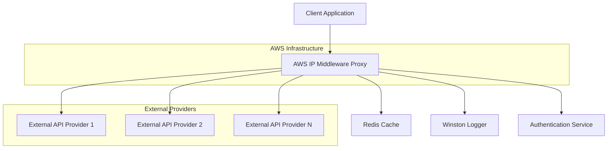
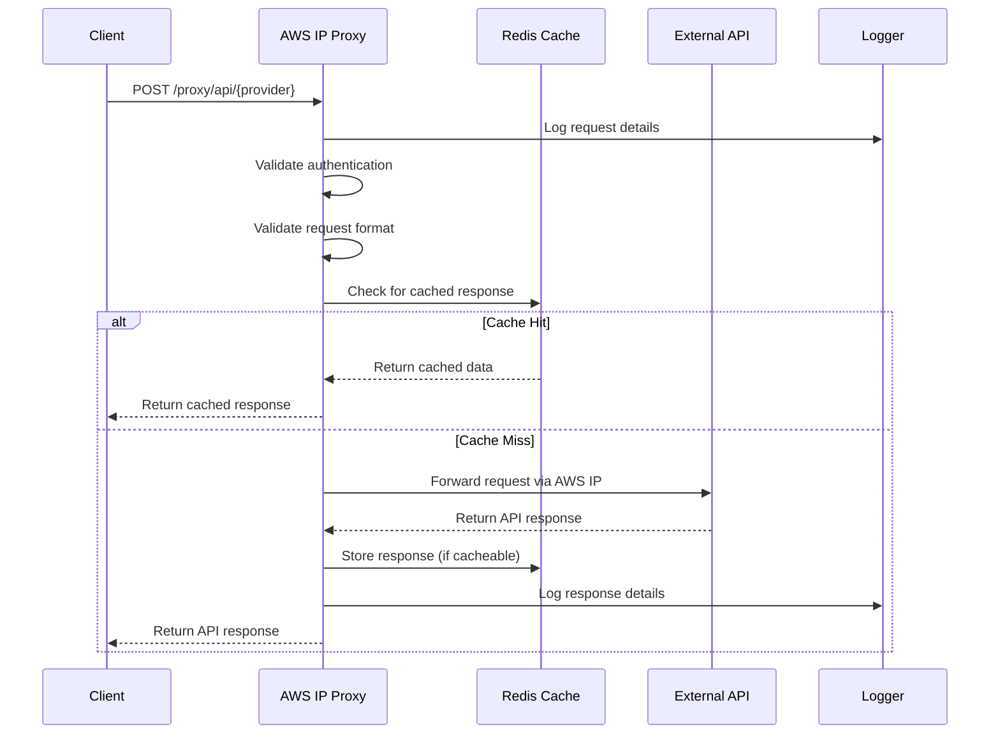

# Design Document

## Overview

The AWS IP Middleware Proxy is a Node.js/Express-based service that acts as a secure intermediary between the betting platform and external API providers. It leverages the existing external API infrastructure while providing a dedicated proxy layer that routes requests through AWS IP addresses that are whitelisted by external providers.

The middleware integrates seamlessly with the existing Express server architecture, utilizing the same patterns for authentication, logging, caching, and error handling already established in the codebase.

## Architecture

### High-Level Architecture



### Request Flow



## Components and Interfaces

### 1. Proxy Route Handler (`/backend/route`)

**Primary Interface:**
- `POST /proxy/api/{provider}` - Main proxy endpoint
- `GET /proxy/health` - Health check endpoint
- `GET /proxy/config` - Configuration status endpoint

**Core Responsibilities:**
- Request validation and authentication
- Provider routing logic
- Request/response transformation
- Error handling and logging

### 2. Provider Configuration Manager

**Interface:**
```javascript
class ProviderConfigManager {
  constructor(configPath)
  loadConfig()
  getProviderConfig(providerId)
  validateProvider(providerId)
  reloadConfig()
}
```

**Configuration Structure:**
```json
{
  "providers": {
    "cricket-api": {
      "baseUrl": "https://marketsarket.qnsports.live",
      "timeout": 10000,
      "retries": 3,
      "cacheTtl": 300,
      "rateLimit": {
        "windowMs": 60000,
        "max": 100
      }
    },
    "casino-api": {
      "baseUrl": "https://casino-provider.example.com",
      "timeout": 15000,
      "retries": 2,
      "cacheTtl": 60,
      "rateLimit": {
        "windowMs": 60000,
        "max": 50
      }
    }
  }
}
```

### 3. Request Proxy Service

**Interface:**
```javascript
class RequestProxyService {
  constructor(httpClient, cache, logger)
  async proxyRequest(provider, endpoint, method, headers, body, queryParams)
  async forwardRequest(targetUrl, options)
  transformRequest(originalRequest, providerConfig)
  transformResponse(originalResponse, providerConfig)
}
```

### 4. Cache Manager

**Interface:**
```javascript
class CacheManager {
  constructor(redisClient)
  async get(key)
  async set(key, value, ttl)
  async del(key)
  generateCacheKey(provider, endpoint, params)
  shouldCache(method, statusCode, headers)
}
```

### 5. Authentication Middleware

**Integration with Existing Auth:**
- Leverages existing JWT authentication from `backend/auth/authMiddleware.js`
- Supports API key authentication for service-to-service calls
- Rate limiting per authenticated user/service

### 6. Logging Service

**Integration with Existing Logger:**
- Uses existing Winston logger from `backend/externalapi/utils/logger`
- Structured logging with request correlation IDs
- Sensitive data masking (API keys, tokens)

## Data Models

### Request Context
```javascript
{
  requestId: "uuid",
  timestamp: "ISO-8601",
  provider: "string",
  endpoint: "string",
  method: "HTTP_METHOD",
  userId: "string|null",
  clientIp: "string",
  userAgent: "string"
}
```

### Provider Configuration
```javascript
{
  id: "string",
  name: "string",
  baseUrl: "string",
  timeout: "number",
  retries: "number",
  cacheTtl: "number",
  rateLimit: {
    windowMs: "number",
    max: "number"
  },
  headers: {
    "key": "value"
  },
  transformations: {
    request: "function|null",
    response: "function|null"
  }
}
```

### Cache Entry
```javascript
{
  key: "string",
  value: "any",
  ttl: "number",
  createdAt: "timestamp",
  provider: "string",
  endpoint: "string"
}
```

### Log Entry
```javascript
{
  level: "info|warn|error",
  message: "string",
  requestId: "string",
  provider: "string",
  endpoint: "string",
  method: "string",
  statusCode: "number",
  responseTime: "number",
  error: "object|null",
  timestamp: "ISO-8601"
}
```

## Error Handling

### Error Categories

1. **Authentication Errors (401)**
   - Invalid JWT token
   - Missing API key
   - Expired credentials

2. **Authorization Errors (403)**
   - Insufficient permissions
   - Rate limit exceeded
   - Provider access denied

3. **Validation Errors (400)**
   - Invalid provider ID
   - Malformed request body
   - Missing required parameters

4. **Provider Errors (502/503/504)**
   - External API unavailable
   - Timeout errors
   - Invalid response format

5. **Internal Errors (500)**
   - Configuration errors
   - Cache failures
   - Unexpected exceptions

### Error Response Format
```javascript
{
  error: {
    code: "ERROR_CODE",
    message: "Human readable message",
    details: "Additional context",
    requestId: "correlation-id",
    timestamp: "ISO-8601"
  }
}
```

### Retry Logic
- Exponential backoff for transient failures
- Circuit breaker pattern for provider failures
- Fallback to cached data when available

## Testing Strategy

### Unit Tests
- Provider configuration validation
- Request/response transformation logic
- Cache key generation and TTL handling
- Authentication middleware integration
- Error handling scenarios

### Integration Tests
- End-to-end proxy request flow
- Redis cache integration
- External API mock responses
- Authentication flow with JWT tokens
- Rate limiting behavior

### Load Tests
- Concurrent request handling
- Cache performance under load
- Provider timeout scenarios
- Memory usage and leak detection

### Security Tests
- Authentication bypass attempts
- Input validation and sanitization
- Rate limiting effectiveness
- Sensitive data exposure in logs

## Performance Considerations

### Caching Strategy
- Redis-based response caching with configurable TTL
- Cache warming for frequently accessed endpoints
- Cache invalidation on provider configuration changes
- LRU eviction policy for memory management

### Connection Pooling
- HTTP agent with keep-alive connections
- Configurable pool size per provider
- Connection timeout and retry configuration
- Health checks for connection pool status

### Rate Limiting
- Token bucket algorithm implementation
- Per-user and per-provider rate limits
- Sliding window rate limiting
- Rate limit headers in responses

### Monitoring Metrics
- Request/response times per provider
- Cache hit/miss ratios
- Error rates by category
- Active connection counts
- Memory and CPU usage

## Security Considerations

### Data Protection
- Request/response body encryption for sensitive data
- API key rotation and secure storage
- Audit logging for all proxy requests
- PII masking in logs and cache

### Network Security
- HTTPS enforcement for all external requests
- Certificate validation and pinning
- IP whitelisting for internal services
- VPC isolation for AWS infrastructure

### Access Control
- Role-based access to different providers
- API endpoint granular permissions
- Service account authentication
- Request origin validation

## Deployment Architecture

### AWS Infrastructure
- EC2 instances with static IP addresses
- Application Load Balancer for high availability
- Auto Scaling Group for demand management
- CloudWatch for monitoring and alerting

### Configuration Management
- Environment-specific configuration files
- Secrets Manager for sensitive credentials
- Parameter Store for runtime configuration
- Configuration hot-reloading capability

### Monitoring and Alerting
- CloudWatch metrics and dashboards
- Custom application metrics
- Error rate and latency alerting
- Health check monitoring